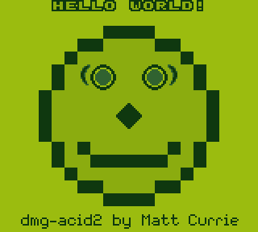

# AngularGB 

_Just another Gameboy emulator for the browser._

I spent a lot of time playing emulated handheld games on my family's computer and my smartphone. Retro gaming never felt "retro" to me, because they were almost everything I used to play, and they were a huge source of inspiration for me to become a software engineer.

Now, equipped with some Computer Science knowledge and an unhealthy amount of free time, I make this project as a tribute to the retro games that made my childhood.

**Although this emulator can render and play simples Gameboy games, it is still very much incomplete and inaccurate. All suggestions and contributions are greatly appreciated!**

## Project overview

As mentioned in the title, AngularGB is a standard Angular application. However, the emulation core is written independently from Angular, most can be found inside folder [src/models](https://github.com/tranHieuDev23/AngularGB/tree/main/src/models) and should be easy to port to any other web front end framework.

Below is the way the current Gameboy component loads a decoded ROM bytes array:

```typescript
public loadRom(rom: number[]): void {
    this.reset();
    if (rom === null) {
        return;
    }
    this.rom = rom;
    const mbc = getMbc(rom);
    this.speaker = new GbSpeaker(48000);
    this.gameboy = new Gameboy(mbc, this.lcd, this.speaker);
    this.resume();
}
```

The `Gameboy()` constructor requires one `GbMbc`, one `Lcd` and one `Speaker` object, representing the cartridge's MBC, the LCD screen and the Speaker. The correct `GbMbc` type - based on the ROM's header - can be retrieved from `getMbc()`, while the two classes `CanvasLcd` and `GbSpeaker` provide concrete implementation for `Lcd` and `Speaker` interface to respectively output graphic and audio to an HTML5 Canvas and the device's speaker. Feel free to extend these two interfaces if extra functionalities are needed.

`Gameboy` allows either running instruction by instruction, or frame by frame. The app maintains a healthy 60 FPS by using `setInterval()` to schedule a new frame every 1/60 of a second.

Initially, I used [Ant Design for Angular](https://ng.ant.design/) to implement the UI, which included a handful of debug tools such as disassembler, CPU/memory/PPU state trackers, etc... However, bundling this library with the core emulation logic somehow slowed the emulator down significantly. Because of that, I removed all usage of Ant Design - along with the debug tools - and rewrote the UI with Bootstrap 5's CSS. The debug tools can still be found in the folder [src/app/components/debug](https://github.com/tranHieuDev23/AngularGB/tree/main/src/app/components/debug), and can still totally work with a `Gameboy` `Input()`, but remember that building the project in production configuration will result in the aforementioned slowdown.

## How to run

To install the project:

```bash
npm install
```

To run development server:

```bash
ng serve
```

To run Jasmine test suite:

```bash
ng test
```

## Current status

### Supported features

- All instructions are implemented except for STOP.
- No DMA Transfer glitch or Wave RAM glitch.
- Memory timing is not accurate for instructions that do both read and write (would be impossible since this condition requires the emulator to run cycle-by-cycle, not instruction-by-instruction).
- ROM-only MBC, MBC1 and MBC2 are supported. This allows the emulator to run a large number of games, but leaves out games with other MBC cartridge types, notably Pokemon Red/Blue which use MBC3.
- **Audio is not implemented correctly.** It works fine with some games (Link's Awakening and Tetris) but breaks uncontrollably with other (Super Mario Land, Dr. Mario). Audio also lags behind graphic noticeably after a while. For now, it's best to disable audio for the best frame rate and experience.

### Tests

#### [Blargg's test ROMs](https://github.com/retrio/gb-test-roms)

| Test           | Result                                                                                    |
| -------------- | ----------------------------------------------------------------------------------------- |
| cpu_instrs     | OK                                                                                        |
| dmg_sound      | Failed 03 (test 11), 09 (test 01), 10 (test 01), 12 (test 01)                             |
| instr_timing   | OK                                                                                        |
| interrupt_time | Failed (`00 00 00 00 08 0D 00 00 00 00 08 0D 7F8F4AAF`)                                   |
| mem_timing     | Failed 03 (test 01)                                                                       |
| mem_timing-2   | Failed 03 (test 01)                                                                       |
| oam_bug        | Failed 01 (test 02), 02 (test 02), 04 (test 03), 05 (test 02), 07 (test 01), 08 (test 02) |
| halt_bug       | Failed                                                                                    |

#### [dmg-acid2](https://github.com/mattcurrie/dmg-acid2) by Matt Currie

OK



## License

GNU General Public License v3.0
